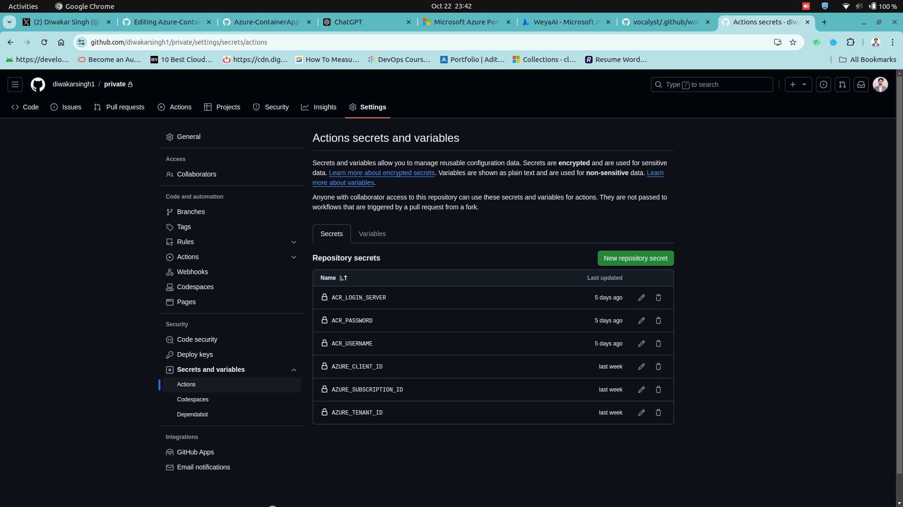

# Azure-ContainerApp-Continuous-Deployment-Using-GitHub-Actions

**In this, I will take you through setting up a GitHub Actions workflow for continuous deployment of a FastAPI application using Docker and Azure Container Apps. FastAPI is a modern web framework known for its high performance and ease of use. In this scenario, we will automate the process of logging into your Azure account, building the FastAPI app into a Docker image, pushing the image to Azure Container Registry (ACR), and deploying the container to Azure Container Apps. This solution ensures seamless continuous deployment, automatically updating your application with each new commit, offering both scalability and agility for modern cloud-native applications.**

<h3>Prerequisites</h3>
<h3>To set up the continuous deployment pipeline for your FastAPI application using GitHub Actions, you will need the following:</h3>

- **Azure Account** 
- **Azure Container Registry (ACR)** 
- **Azure Container App** 
- **Azure App Registration** 
- **GitHub**
- **Docker**

> [!IMPORTANT]
> Step 1 to Step 4 is the manual setup. Automatic deployment will start from the Step 5.

<h2>Step 1: Create a Sample FastAPI Project with .env and requirements.txt</h2>

- **Create a project directory: First, create a new directory for your FastAPI project:**
  
      mkdir fastapi-sample
      cd fastapi-sample
  
- **Create a main.py file: Inside the project directory, create a file named main.py:**

      vim main.py
  
- **Add the following code to main.py:**

      from fastapi import FastAPI
      import os

      app = FastAPI()

      @app.get("/")
      def read_root():
          return {"message": "Welcome to FastAPI", "environment": os.getenv("ENVIRONMENT", "development")}

This code creates a simple FastAPI application that reads an environment variable (ENVIRONMENT) from a .env file.

- **Create a .env file: Create a .env file to store environment variables:**

      vim .env
  
- **Add the following content to the .env file:**

      ENVIRONMENT=production

- **Create a requirements.txt file: To make sure all dependencies are easily managed, create a requirements.txt file:**

      vim requirements.txt
  
- **Add the installed dependencies to this file:**

      fastapi
      uvicorn
      python-dotenv  # Needed to load environment variables from .env

**Congrats! 🎉 Your FastAPI application has been successfully developed.**
**Next, we can proceed with containerizing the application using Docker.**

- **Create a docker directory inside your fastapi-sample directory:**

      mkdir docker
      cd docker

- **Create a Dockerfile:**

      vim Dockerfile

- **Add the following code in Dockerfile:**

      FROM python:3.11.2

      WORKDIR /app

      RUN apt-get update && apt-get install -y \
          locales \
          locales-all

      COPY ./requirements.txt /app/requirements.txt

      RUN pip install --no-cache-dir --upgrade -r /app/requirements.txt

      COPY . /app/
      COPY .env /app/
      COPY ./docker /app/docker

      ENV TZ=Asia/Kolkata
      RUN chmod +x /app/docker/run.sh

      EXPOSE 8000

      ENTRYPOINT ["/app/docker/run.sh"]

- **Create a run.sh file that will help to run the FastAPI server on start of new container:**

      vim run.sh

- **Add the following code in run.sh:**

      #!/bin/sh
      cd /app/
      uvicorn app:app --host 0.0.0.0
**Congrats! 🎉 You have successfully containerized your FastAPI application.**

<h2>Step 2: Create the Azure Container Registry (ACR)</h2>

- In Azure dashboard navigate to **Search > Container Registry > Create.**

- **Enter the name of your Azure Container Registry:**

- **Let's have a overview of Azure Container Registry:**

- **This is the login server name by which you can login to your ACR:**

**Congrats! 🎉 You have successfully created your Azure Container Registry (ACR).**

<h2>Step 3: Login and push the image to the ACR.</h2>

- **Login to the ACR using the command below:**

      docker login mycontainerregistry.azurecr.io
  
- **You will prompted to enter username and password to login:**
- **Navigate to the Access key tab in your registry dashboard:**
- **You will find the login username and password, enter the username and password:**
- **Inside the fastapi-sample run the below docker command to build the image:**

      docker build -t mycontainerregistry.azurecr.io/hello-world:latest -f docker/Dockerfile .

> [!NOTE]
> Be sure to include the ACR server name in your Docker image, as demonstrated above.

- **Now push the Image to your Azure Container Registry (ACR):**

      docker push mycontainerregistry.azurecr.io/hello-world:latest

**Congratulations! 🎉 You have successfully pushed the image to your Azure Container Registry (ACR).**

<h2>Step 4: Create the Azure Container App</h2>

> [!NOTE]
> Create the Azure Container App within the same resource group, region and subscription as the Azure Container Registry (ACR).

- **In the Azure Portal, navigate to _Search > Container App > Create_.**
- **Select the appropriate Subscription.**
- **Choose the same Resource Group as your ACR.**
- **Specify a unique name for your Container App.**
- **Set the Deployment Source to _Container Image_.**
- **Select the Azure region where the app will be deployed.**
- **Proceed to the next step by clicking _Next_.**
- **Provide a name for the Container within the app.**
- **Set the Image Source to Azure Container Registry (ACR).**
- **Ensure the Subscription matches the one used for ACR.**
- **Select the ACR instance you created earlier.**
- **Specify the Docker image and its corresponding tag that you wish to deploy.**
- **Click _Next_ to continue.**
- **Enable Ingress traffic.**
- **Allow external traffic access.**
- **Choose the Ingress type as HTTP.**
- **Set the Target Port to 8000 (for FastAPI) or any port on which the application is running inside the container.**
- **Click _Create_ to finalize the deployment.**

**Congratulations! 🎉 You have successfully created the Azure Container App using Azure Container Registry (ACR) as the image source.**

<h1>Automatic Deployment setup starts here.</h1>

<h2>Step 5: Create the Azure App Registration</h2>

- In Azure dashboard navigate to **Search > App Registration > Create.**

- **Enter the name of your App registration.**
- **Click Register.**

- **Note the Client-ID and Tenanat-ID**
- **Click on Certifications and Secrets.**
- **Click on Federated Credentials and click on add credentials.**

- **Select the GitHub action deploying azure resource in Federated credentials scenario.**
- **Enter GitHub organisation name.**
- **Enter the name of the repo.**
- **Select entity type as branch**
- **Subjent identifier as "main" i.e., your branch name.**
- **Enter the name of that credential.**
- **Click Add.**

**Congratulations! 🎉 You have successfully created the Azure App Registration for GitHub Action continous deployment.**

<h2>Step 6: Provide the role of contributor that you have just created in App registration.</h2>

- **Click on the subscription on the Azure dashboard.**
- **Click the subscription in which you have done all your setup, like your ACR, Azure Container App.**
- **Click on Access Control (IAM)**
- **Click on Add and again click on Add Role Assignment.**
- **Select as administrator roles.**
- **Enter the member and search for the name that you just created in App Registration.**
- **Click on assign.**

**Congratulations! 🎉 You have successfully assigned the contributor role to the Azure App Registration for GitHub Action continous deployment.**

<h2>Create the GitHub Action in the in which you want to implement the automatic deployment.</h2>

- **Click on Action and then click on setup a workflow yourself.**
- **Paste the below YAML file.**
  
      name: Deploy FastAPI to Azure   #name of your github action

      on:
        push:
          branches:
            - main  # Change to the branch you want to track

      permissions:
        id-token: write   # Allow this job to create the OIDC token
        contents: read    # Read the content of the repo

  
      jobs:
        build-and-deploy:  # Name of your job
          runs-on: ubuntu-latest    # Operating System to rnu the Job. It is also known as GitHub Runner

          steps:
            - name: Checkout   # To checkout the code
              uses: actions/checkout@v3
            
        
            - name: Azure login
              uses: azure/login@v2
              with:
                client-id: ${{ secrets.AZURE_CLIENT_ID }}
                tenant-id: ${{ secrets.AZURE_TENANT_ID }}
                subscription-id: ${{ secrets.AZURE_SUBSCRIPTION_ID }}

            - name: Azure CLI script
              uses: azure/cli@v2
              with:
                azcliversion: latest
                inlineScript: |
                  az account show

            - name: Build and Push Docker Image to ACR
              run: |
                IMAGE_NAME=${{ secrets.ACR_LOGIN_SERVER }}/fastapi:latest
                cd ${{ github.workspace }}
                docker build -t $IMAGE_NAME -f docker/Dockerfile .
                echo ${{ secrets.ACR_PASSWORD }} | docker login ${{ secrets.ACR_LOGIN_SERVER }} -u ${{ secrets.ACR_USERNAME }} --password-stdin
                docker push $IMAGE_NAME

            - name: Deploy to Azure Container App
              run: |
                az containerapp update \
                  --name test \
                  --resource-group vocalyst-sweden \
                  --image ${{ secrets.ACR_LOGIN_SERVER }}/fastapi:latest

**We are using the approach of OIDC Connect to Login into our Azure account.**

<h3>What is OIDC connect?</h3>

-****OIDC (OpenID Connect)** allows GitHub Actions to securely authenticate with Azure without storing credentials. Instead of using service principals or secrets, GitHub provides an OIDC token during the workflow run, which is exchanged for an Azure access token via Azure AD. You configure a **Federated Identity Credential** in Azure to trust GitHub's OIDC token. This token allows short-lived access to Azure resources, improving security and removing the need for managing long-term credentials in GitHub secrets.**

**To get the value _ACR_LOGIN_SERVER_, _ACR_PASSWORD_, & _ACR_USERNAME_ navigate to-**
-**Search > Azure Container Registry > Click on the ACR that you just created.**

-**Click on Access Key and find the Login Server, Password, Username.**

**Congratulations! 🎉 You have successfully created the workflow file for Continuous deployment.**

<h2>Step 6: Create the Secrets in the repo.</h2>

-**Navigate to the settings > Secrets and Variables > Actions > Secrets.**

-**Click on New Repository Secrets And Enter the Varibale name and its value and then add secrets.**

-**As you also created the .env file and its not the good practise to put the .env file in the repo. So we will use the same concept of secrets to add the value of .env variables and its value.**
-**In .env there is only variable i.e., ENVIRONMENT=production to add this clcik to add secrets.**
-**Enter the name of the Variable and its value.**
-**And then Add secrets.**

**How to use .env in the workflow file.**
-**Here is the updated workflow file.**

      name: Deploy FastAPI to Azure   #name of your github action

      on:
        push:
          branches:
            - main  # Change to the branch you want to track

      permissions:
        id-token: write   # Allow this job to create the OIDC token
        contents: read    # Read the content of the repo

  
      jobs:
        build-and-deploy:  # Name of your job
          runs-on: ubuntu-latest    # Operating System to rnu the Job. It is also known as GitHub Runner

          steps:
            - name: Checkout   # To checkout the code
              uses: actions/checkout@v3

            - name: Creating .env file
              run: |
                touch .env
                echo "ENVIRONMENT=${{ secrets.ENVIRONMENT }}" >> .env
        
            - name: Azure login
              uses: azure/login@v2
              with:
                client-id: ${{ secrets.AZURE_CLIENT_ID }}
                tenant-id: ${{ secrets.AZURE_TENANT_ID }}
                subscription-id: ${{ secrets.AZURE_SUBSCRIPTION_ID }}

            - name: Azure CLI script
              uses: azure/cli@v2
              with:
                azcliversion: latest
                inlineScript: |
                  az account show

            - name: Build and Push Docker Image to ACR
              run: |
                IMAGE_NAME=${{ secrets.ACR_LOGIN_SERVER }}/fastapi:latest
                cd ${{ github.workspace }}
                docker build -t $IMAGE_NAME -f docker/Dockerfile .
                echo ${{ secrets.ACR_PASSWORD }} | docker login ${{ secrets.ACR_LOGIN_SERVER }} -u ${{ secrets.ACR_USERNAME }} --password-stdin
                docker push $IMAGE_NAME

            - name: Deploy to Azure Container App
              run: |
                az containerapp update \
                  --name test \
                  --resource-group vocalyst-sweden \
                  --image ${{ secrets.ACR_LOGIN_SERVER }}/fastapi:latest

**With this way yo can use the environmental variables of your project i.e., .env file.**

<h1>Voila!💥 Your Azure ContainerApp continuous deployment using GitHub actions is ready.</h1>
